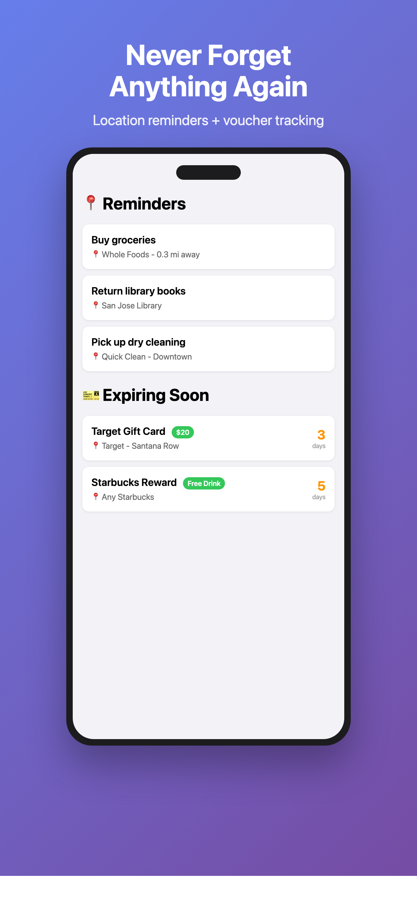
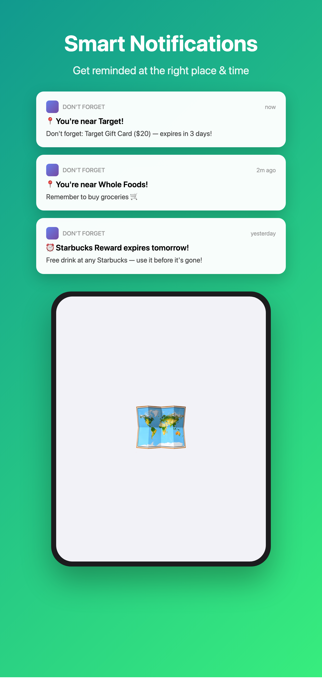
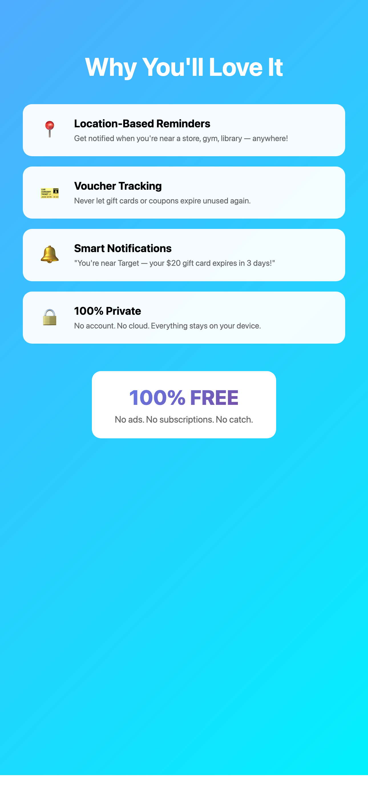

# Don't Forget 📍🎫

**Location-based reminders + voucher tracking. Never forget anything again.**

## The Problem

- Drive past the grocery store, remember you needed milk... when you're already home
- Find expired gift cards in your wallet you forgot to use
- Miss using coupons before they expire

## The Solution

Don't Forget combines **location-based reminders** with **voucher tracking**:

> "You're near Target — don't forget your $20 gift card expiring in 3 days!"

## Features

### 📍 Location Reminders
- Set reminders tied to locations
- Get notified when you arrive (or leave)
- Works even when app is closed

**Examples:**
- "Buy milk" → triggers near grocery store
- "Return library books" → triggers near library
- "Pick up dry cleaning" → triggers near cleaner

### 🎫 Voucher Tracking
- Track gift cards, coupons, rewards with expiration dates
- Get notified 7 days, 3 days, and 1 day before expiry
- Combined alerts: location + expiration

### 🔔 Smart Notifications
- Location-triggered reminders
- Expiration warnings
- Combined: "You're at Target + your gift card expires soon!"

### 🔒 100% Private
- No account required
- No cloud storage
- Everything stays on your device
- Location used only for geofencing

## Screenshots

  
  
  
  

## Requirements

- iOS 17.0+
- Xcode 15.0+
- Location permissions (for geofencing)

## Installation

1. Clone this repo
2. Open `DontForget.xcodeproj` in Xcode
3. Build and run
4. Allow location permissions when prompted

## Tech Stack

- SwiftUI
- CoreLocation (geofencing)
- UserNotifications
- MapKit (place search)
- UserDefaults (local storage)
- No external dependencies

## Privacy

Location data is used **only** for triggering reminders when you're near saved places. We don't collect, store, or transmit your location data anywhere.

## License

MIT License - feel free to use, modify, and distribute.

## Author

Built by Yuxuan

---

**100% FREE** — No ads. No subscriptions. No catch.
